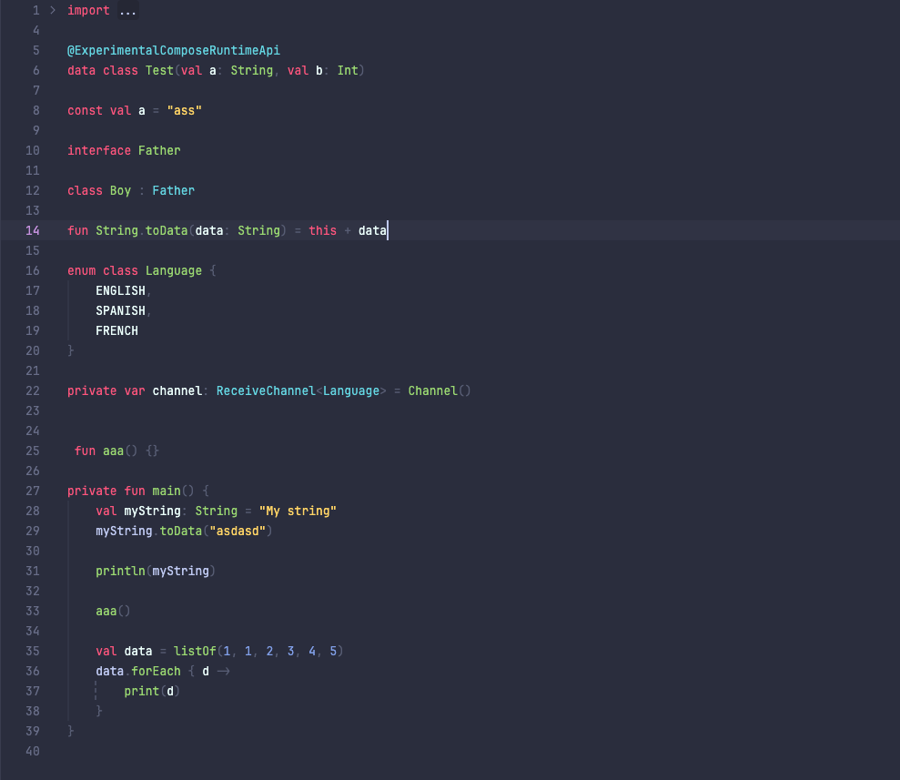
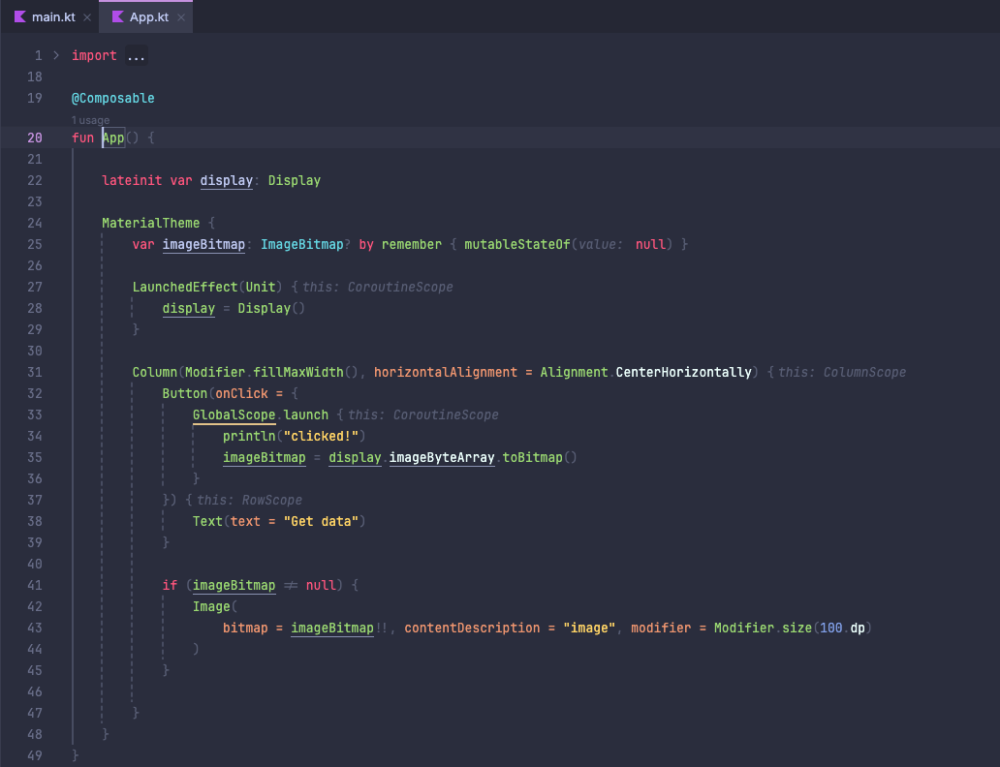

# fleet-theme-plugin-monokai

Basic monokai theme implementation for fleet, based on https://github.com/catppuccin/fleet Frape.

# JetBrains Fleet Theme Plugin
Repository that provides a template to create custom themes for
[JetBrains Fleet][fleet:website].

## Documentations

- [Fleet Plugin SDK Documentation][fleet:sdk-documentation]
- [Examples: Fleet Theme plugin][fleet:theme-plugin-example]

[fleet:website]: https://www.jetbrains.com/fleet/
[fleet:theme-plugin-example]: https://github.com/JetBrains/fleet-sdk-gradle-plugin/tree/main/examples/theme-plugin
[fleet:sdk-documentation]: https://github.com/JetBrains/fleet-sdk-gradle-plugin

## Examples

 
